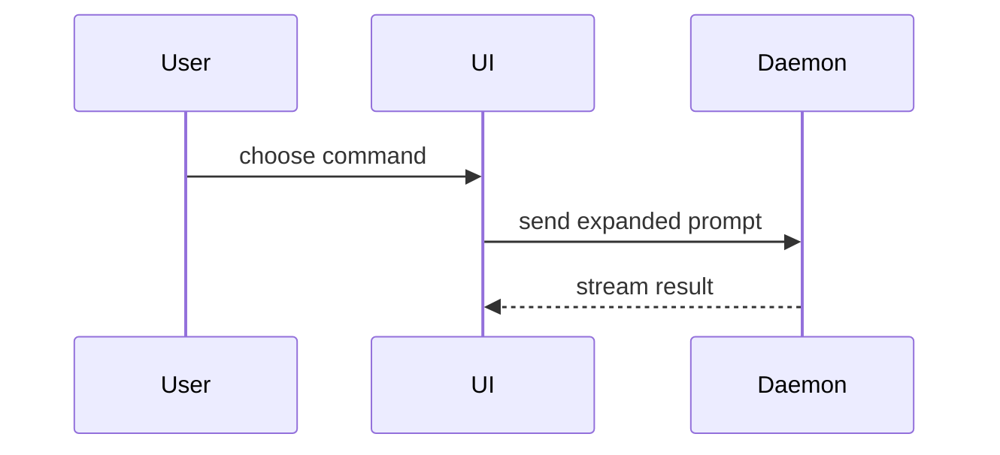

# PR review

Review the pull request at the link the user gave. If no link was given, ask for one.

## Repo host

The PR is on Bitbucket. Use the Bitbucket MCP server to fetch the PR's title, description, branch, commits, full diff and existing comments. When the tools are missing or the fetch fails, stop and tell the user.

## Steps

1. Fetch the PR (see Repo host).
2. Find Jira keys (like `PROJ-123`) in the PR title, description, branch and commit messages. For each key, fetch the issue with the Jira MCP server. Skip this step when there are no keys.
3. Review the diff. Read every changed file, and the surrounding code when the diff alone can't show whether a change is correct. Check for:
   - **Bugs**: wrong logic, unhandled edge cases, broken error handling, race conditions.
   - **Performance**: needless work in loops, N+1 queries, unbounded memory, blocking calls.
   - **Security**: injection, missing auth checks, leaked secrets, unsafe input handling.
   - **Code quality**: apply YAGNI hard. Flag code that could be simpler, abstractions with a single use, speculative options, and duplication of what already exists in the codebase.
   - **Task fit** (only with a Jira issue): requirements the PR misses, and changes outside the issue's scope.
   - **Impact**: assess reversibility and blast radius using the guidance below. Trace affected callers, shared components, data flows and deployment steps beyond the changed files where needed to establish the scope.
4. Write the report as an HTML page with the `html-report` skill (see Report). Skip existing comments that already raise a finding.
5. In chat, give the page path, the impact level, the review verdict and the number of findings. Highlight any hard-to-reverse or one-way change. Ask which comments, by number, to post to the PR. Post only the ones the user names, then confirm what was posted.

## Report

Use this template for the content, not styling of the report:

```
## Impact and Merge Danger

**Importance and review depth:** <low, medium or high; reason and review focus>

**Reversibility:** <easy to revert, costly to reverse, one-way or unknown>

<optional: description>

**Blast Radius:** <one-word description>

<optional: potential ramifications of merge>

**Review verdict:** <approve, approve with minor fixes, or needs changes>

## Summary

<diagram, diff-sketch, or tree>

## Issues

<the individual issues with their sections from below>

```

Follow the `html-report` skill's steps and formatting. Title the page with the PR title and link to the PR. Immediately below the title, before the summary or findings, include **Impact and Merge Danger** using the guidance below. Include it even when there are no findings.

Then give the review verdict: approve, approve with minor fixes, or needs changes. If nothing was found, say so in one line. Keep this correctness verdict separate from impact: a correct PR can still need deep review because of its consequences.

After the visual summary, list the findings under **Issues**, ordered by severity, highest first, numbered so the user can pick comments by number. Keep every line short and plain; cut anything the reader doesn't need to understand the issue. One section per finding:

- **Heading**: `<n>. <file>:<line>: <short title>`
- **Issue**: what is wrong and why it matters, one or two sentences.
- **Fix**: the change to make, a code block if it's clearer.
- **Comment**: the PR comment, ready to post, written to the author, in a block that is easy to copy.

## Summary

Skip all preambles and keep prose brief, this section should show visually what the changes do, rather than try to explain them.

Pick the smallest view that makes the key point clear.

- Show logic or an algorithm as pseudocode:

```text
on(save)
  if content is unchanged
    return cached result
  write new content
  return fresh result
```

- Show runtime control flow as a call tree:

```text
submitForm
  createSession
    persistPrompt
    launchAgent
  navigateToSession
```

- Show UI structure as a component tree, including state and module boundaries that matter:

```text
<SessionPage> (apps/example/src/routes/session.tsx)
  useSessionEvents()
  <SessionToolbar>
    <RunSkillButton> (packages/ui)
```

- Show file responsibility or a broad refactor as a shallow file tree:

```text
src/
├── commands/       # parses user actions
├── sessions/       # owns session state
└── transport/      # sends API requests
```

- Show component interaction, control flow, or data flow with Mermaid:



- Use `diff` when the point is what changes and the surrounding shape already exists. Match the diff shape to the topic.

For a component change:

```diff
 <SessionPage>
   useSessionEvents()
   <SessionToolbar>
+    <RunSkillButton />
   <SessionTimeline>
+    <SkillResultCard />
```

For a file-layout change:

```diff
 src/
 ├── commands/
+│   └── show-me.ts       # expands the slash command
 ├── sessions/
-└── transport.ts
+└── transport/
+    ├── client.ts
+    └── stream.ts
```

For a call-tree or call-stack change:

```diff
 submitForm
   createSession
     persistPrompt
+    expandSkillMention
     launchAgent
-  navigateToSession
+  navigateToSession
+    subscribeToEvents
```

For a state or control-flow change:

```diff
 on(save)
-  write content
+  if content is unchanged
+    return cached result
+  write new content
+  invalidate cache
```

- Show the whole block when most of it is new, when omitted context would hide ownership or order, or when the user needs a copyable target shape:

```ts
function expandSkill(command: string): string {
  const skillName = command.slice(1);
  return `use the ${skillName} skill`;
}
```

## Impact and Merge Danger

Keep this opening section compact enough to help the user decide how deeply to review the PR. Assess the consequences of shipping the change, including plausible failures, rather than using diff size or finding count as a proxy for importance. Ground claims in the diff and surrounding code; distinguish confirmed effects, plausible risks and unknowns.

- **Importance and review depth**: give an overall impact level (low, medium or high), a one-sentence reason and a recommended review depth. Low suits isolated, readily reversible changes; medium suits meaningful but bounded effects; high suits broad or severe consequences, costly recovery or irreversible effects. Name the areas that deserve the closest review. State business importance or urgency only when supported by the PR or linked issue.
- **Reversibility**: label the change easy to revert, costly to reverse, one-way or unknown. Explain what rollback actually requires after deployment and use, including any remaining effects. A Git revert alone does not undo data loss, writes in a new format, external side effects or consumer adoption. For migrations and backfills, check data preservation, old/new version compatibility, locks or downtime, and the cost of restoring or transforming data back. Identify required backups, recovery steps or rollout sequencing when supported; do not assume every migration is irreversible or that a down migration guarantees safe recovery. Make costly or one-way changes prominent in plain text.
- **Blast radius**: describe who and what can be affected, how far the effect can spread, and the severity of plausible consequences. Consider direct and indirect effects across shared dependencies and consumers, including users, routes, tenants, services, clients and environments. Check relevant dimensions beyond backend correctness: layout shifts, mobile responsiveness, accessibility and browser compatibility; API, schema, event, configuration and package compatibility; data integrity, security and privacy; performance, availability, infrastructure and deployment behavior. These are prompts, not an exhaustive list: follow the actual dependencies and report material effects, rather than listing unrelated hypothetical risks. Account for feature flags, staged rollouts and other verified limits on exposure.
